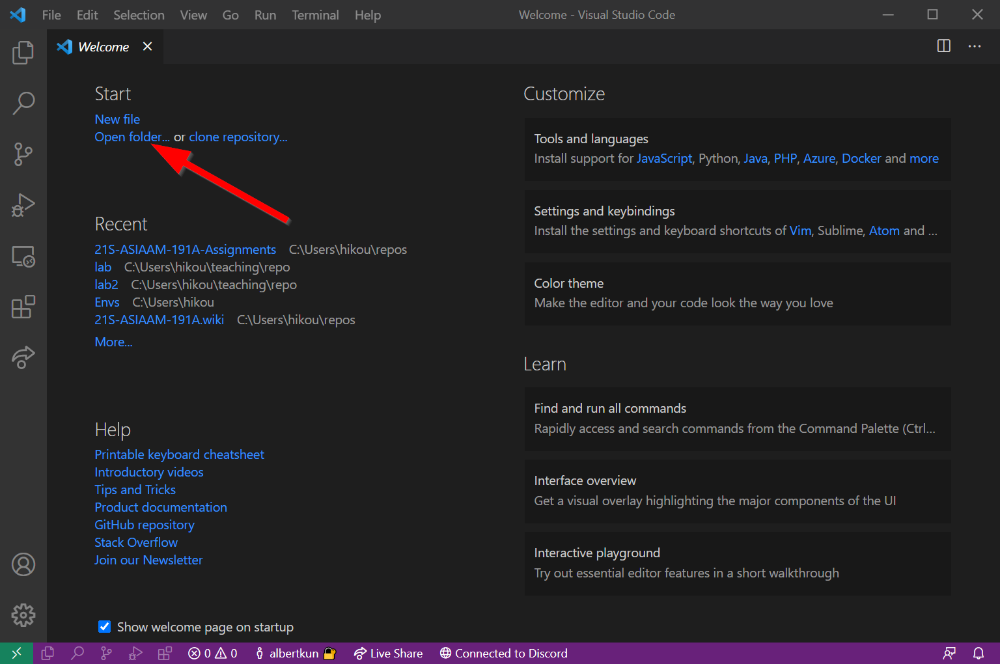
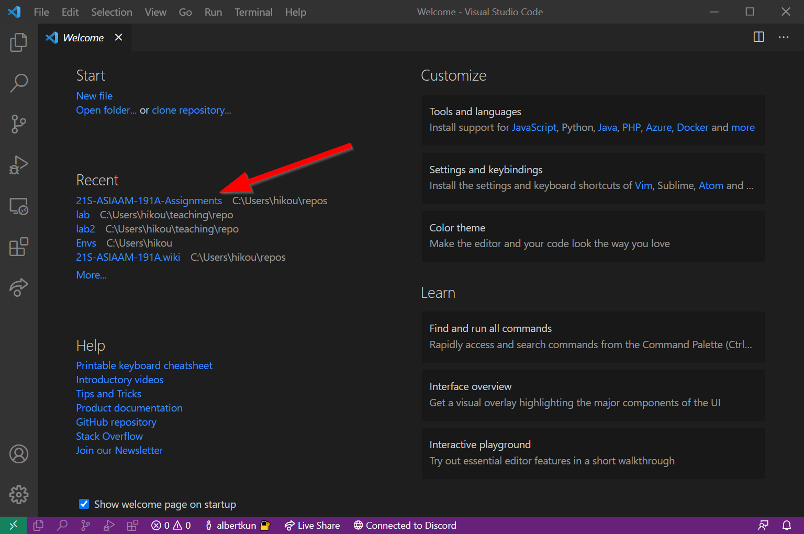
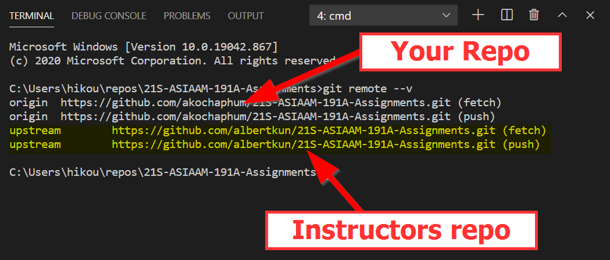
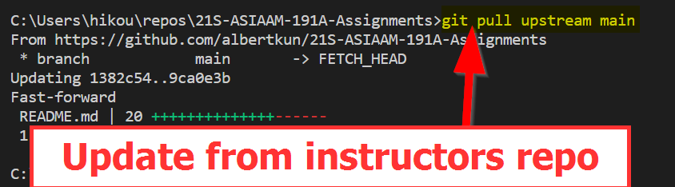
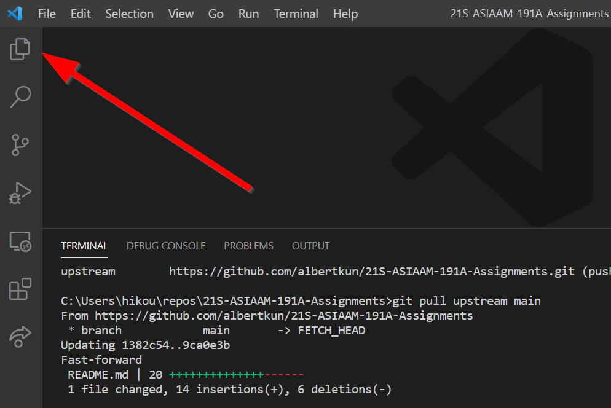
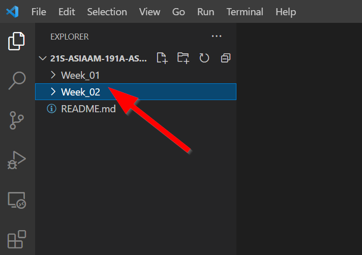

# Updating the Lab Assignment repo
### Requirements:
- [Forked Lab Assignment repo guide completed](../Guides/git_forking.md)

This guide will walk you through how to update the forked lab assignment repo. 

## Open the Lab Assignment repository
In VS Code find and open the folder for the lab assignment repository.

If you recently worked on the lab you can find it in the **"Recent"** section like so:

Checking the Remote Upstream
To make sure that the remote upstream is correct, run the command:
>`git remote --v`

The `origin` should be set to your account, while the `upstream` to be set to the instructors account `albertkun`:

### Wrong upstream?
If you have the wrong upstream, remove the current `upstream` by running: 
>`git remote rm upstream`

And then add the correct upstream by running:
>`git remote add upstream https://github.com/albertkun/21S-ASIAAM-191A-Assignments.git`

## Update the repo
As with every week, start with pulling from the main repository by running:

>`git pull upstream main`

It should look something similar to this:

Open the Explorer tab in the activity bar to see if the new week has appeared:

If it has, then congratulations, it should look something like this:

