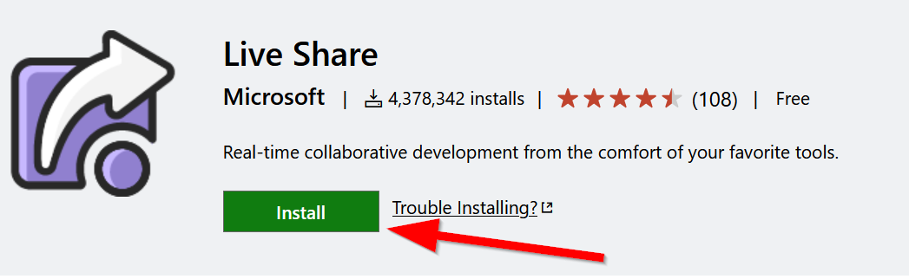
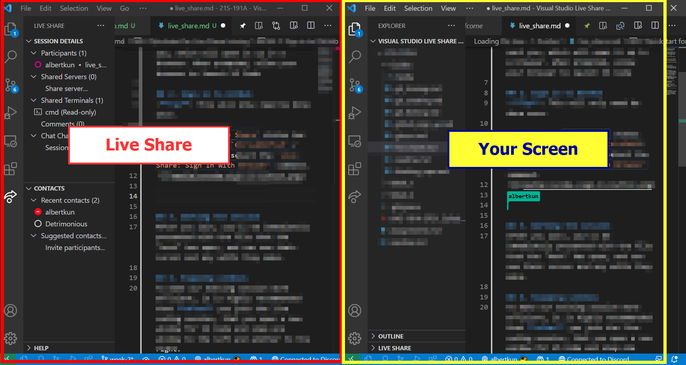

# Quickstart for Live Share
Make sure you have installed the Live Share extension by going to the following link and clicking on "Install": 

>[https://marketplace.visualstudio.com/items?itemName=MS-vsliveshare.vsliveshare](https://marketplace.visualstudio.com/items?itemName=MS-vsliveshare.vsliveshare)

You can read the documentation to learn more about Live Share and what it does too:

>[https://docs.microsoft.com/en-us/visualstudio/liveshare/](https://docs.microsoft.com/en-us/visualstudio/liveshare/)

After installing Live Share, you can join a session with these steps:

## 1. Click on the Join url
Click the session URL the "host" sent you, which will open it up in a browser. When prompted, allow your browser to launch VS Code

## 2. Sign in to GitHub
>**Tip**: This will only need be done once.

Click on the `Live Share` status bar item **or** press `Ctrl+Shift+P` / `Cmd+Shift+P` and select the `Live Share: Sign In With Browser` command.

## 3. Working the session
After you join, you'll be immediately presented with the file that the "host" has open, and can see their cursor and any edits they make.

## 4. Snapping windows
To make our editing session more efficient, it is highly recommended that **after** you join the live coding session, that you open a new window for VS Code and snap one window to the left and another to the right.

The ideal layout should look something like the following:

- How to Snap windows on [Mac](https://techwiser.com/snap-windows-on-macos/)

- How to Snap windows on [PC](https://support.microsoft.com/en-us/windows/snap-your-windows-885a9b1e-a983-a3b1-16cd-c531795e6241)

## Optional: Host your own session
Click the "live share" button to immediately start sharing your coding session.

An invitation link will automatically be copied to your clip board, you can invite anyone to join your session by sharing it. 

You can join your own collaboration session by clicking the link yourself. open it in any browser to join your session.