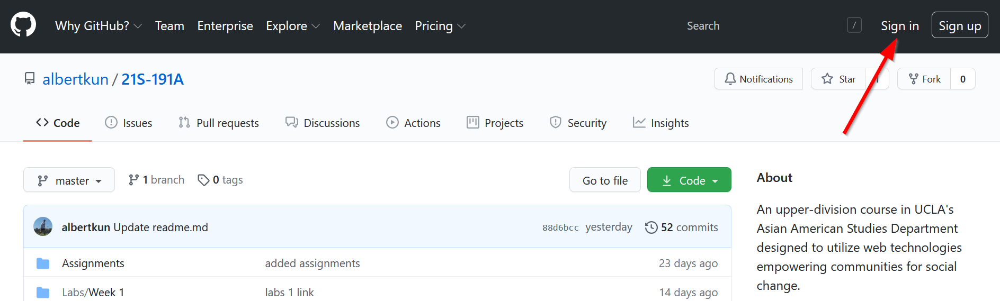
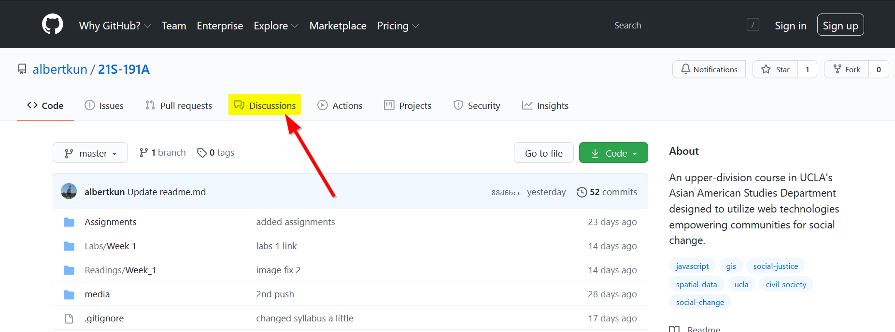
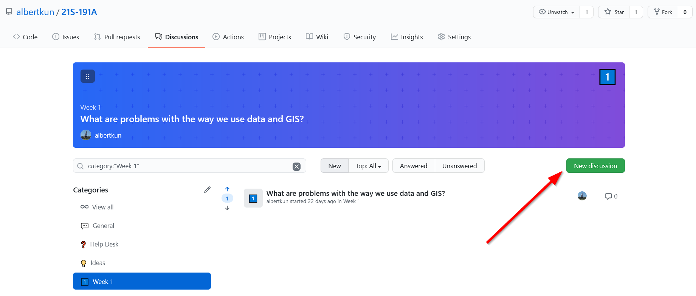
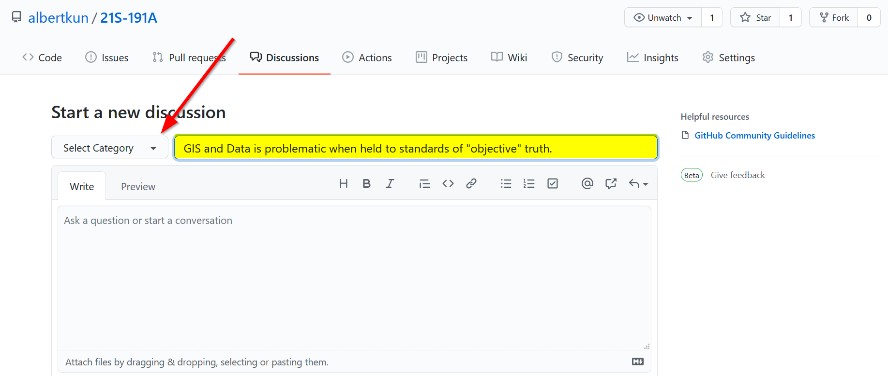
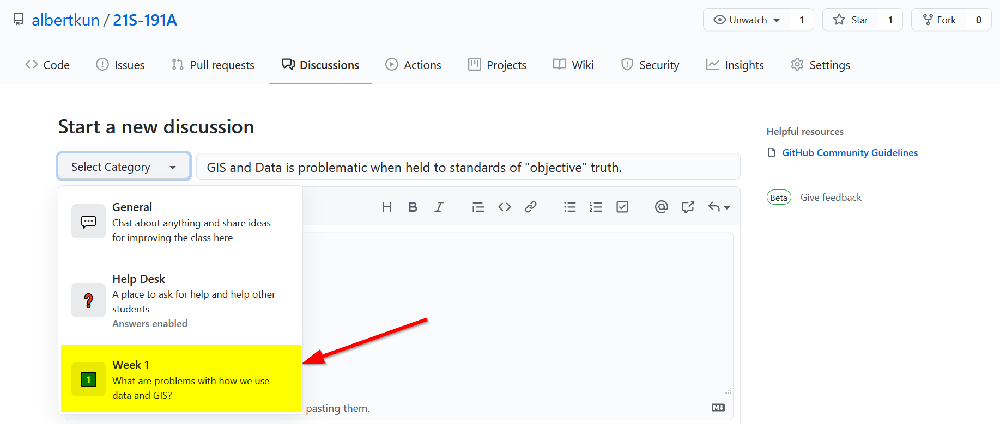
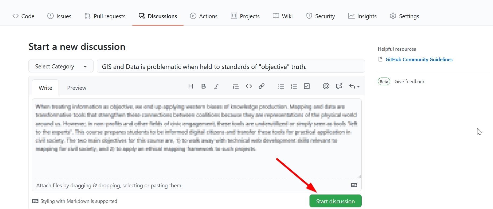
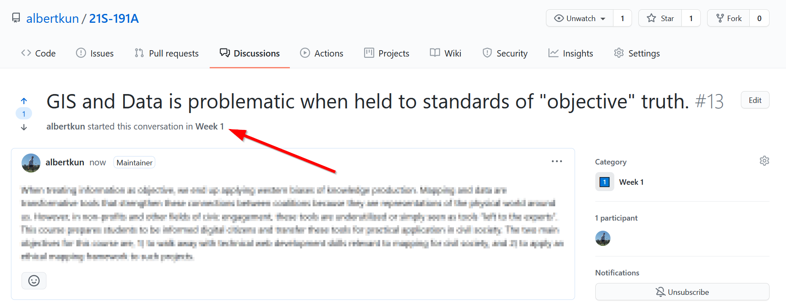
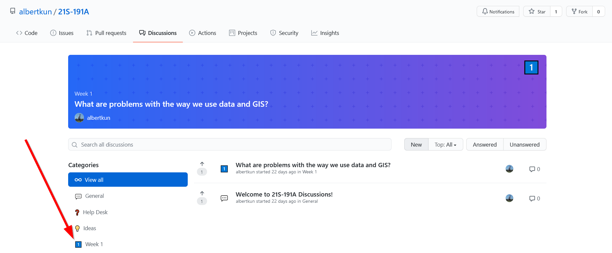
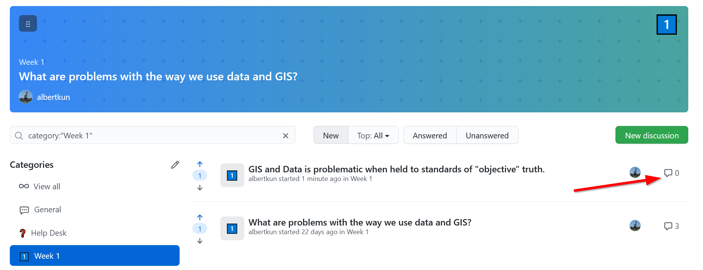
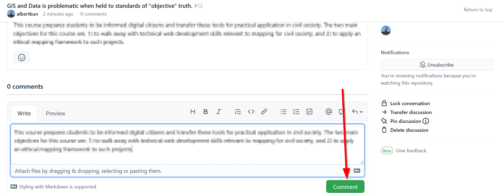

# How to Submit a Thinking Cap Discussion

## Part One: Posting your own discussion
**Due at 12am PST on Mondays**
1. Make sure you are signed into your GitHub account. 
2. Go to the [course repository](https://github.com/albertkun/21S-191A)
3. Click on "**Discussions**"
4. Click on "**New Discussion**" 
5. Add a title and click on "**Category**"
6. Choose the week you are submitting for, in this case it will be Week 1:
7. Respond to the prompt for the week.
8. Click on "**Start Discussion**"
9. The first part of assignment is now complete!
10. You can proceed to **Step #12** if you click on the Week you are on: 

## Part 2: Responding to discussions
11. Go to the discussion page on the GitHub repository
12. Click on the week you are responding for, in this case **Week 1** 
13. Try to look for student posts with no replies. 
14. Click on the discussion count or the discussion 
15. Type a thoughtful reply and click "**Comment**".
16. Repeat **Steps #12 - #15** for another student.
17. Congratulations on finishing the assignment!
    