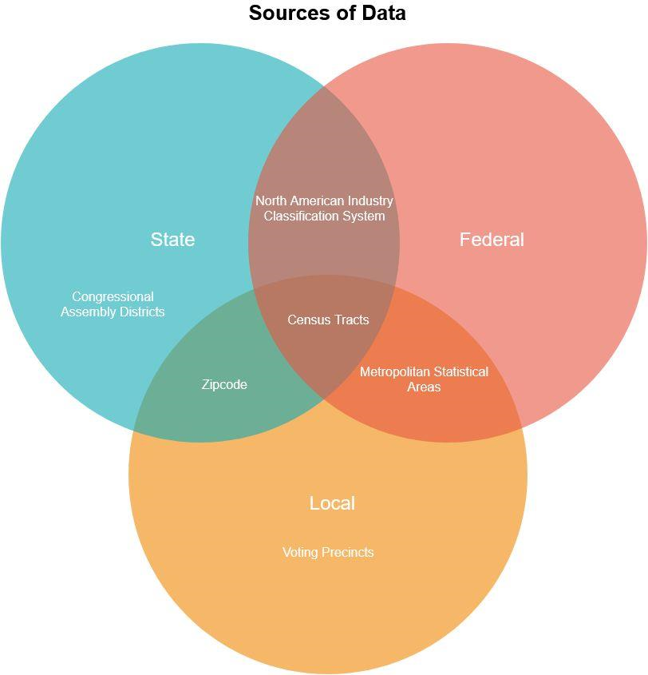

# Introduction to GIS

What is GIS? Depending on who you ask, GIS has two meanings:

**Geographic Information System** typically refers to applications and
software that is used to create spatial data and to investigate spatial
relationships between that data.

**Geographic Information Science** is the framework we use to ask questions
about the spatial relationship between data.

For example, predicting the effects of climate change (rising
sea-levels) on low laying areas (elevation) would be an application of
Geographic Information Science, while the software to do the predictions
would be an example of a Geographic Information System.

In short:

## Data Types

There are two key distinction between data types, spatial or non-spatial
data.

Spatial data is data that already contains geographic information.

Common file types are the following:

-   **Shapefiles:** .zip (these are made up of 5 files, and the .shp is
    commonly used to identify them)

-   **KML files:** .kml, .kmz

-   **GeoJSON files:** .geojson

-   **JPG files**: .jpg\*

Non-spatial data is data that has no geographic information.

Common non-spatial data are the following:

-   **Excel Spreadsheets**: .xlsx, .xls

-   **Comma/Table Separated Value files**: .csv, .tsv

-   **JSON files**: .json

-   **dBase database file**: .dbf

When non-spatial data has geographic attributes, like zipcodes,
addresses, city names, or even latitude/longitude coordinates it can be
turned into spatial data. The distinction is that non-spatial data will
only show up as tables in GIS applications.

On the other hand, spatial data that has data attributes can be turned
into a non-spatial data type by saving/exporting its data as tables. The
following graphic summarizes this relationship:

## Spatial Data Formats

There are several data spatial data models that you may encounter as you
work with geo data. Geodata formats are commonly divided into two types,
vector data or a raster data. In GIS, discrete data means that the data
has a fixed location. Conversly, continuous data does not have well defined locations, a common example is elevation, where shorelines differ depending on the time of day. The graphic below shows how vector data and raster data formats can represent continuous or discrete data:

Spatial Data Types (Source: Michele Tobias, UC Davis)

The graphic also illustrates how certain vector data is often better
suited for discrete data, while raster data is often better used for
continuous data. Let's go into a little more detail about each!

### Vector Data

Vector data represents discrete objects in the real world with points,
lines, and polygons in the dataset.

If you were to draw a map to your house for a friend, you would
typically use vector data - roads would be lines, a shopping center
included as an important landmark might be a rectangle of sorts, and
your house might be a point (perhaps represented by a star or a house
icon).

### Raster Data

Raster data represents continuous fields or discrete objects on a grid,
storing measurements or category names in each cell of the grid.

Digital photos are raster data you are already familiar with. If you
zoom in far enough on a digital photo, you\'ll see that a photo is made up
of pixels, which appear as colored squares. Pixels are cells in a
regular grid and each contains the digital code that corresponds to the
color that should be displayed there.

You may be surprised to see jpgs listed as a data type that you may have
thought to be non-spatial, but satellite imagery is commonly stored in
photo formats.

## GIS and Social Sciences

Now that we have a good understanding of geospatial data, we can explore
the GIS connection to the social sciences.

Geography is divided into physical geography (natural systems) and human
geography (human-made systems). The social sciences sit within
human-made systems and the data here is often captured in specific
units. Such as number of people living in a specific city or the
language spoken in a country. Thusly, most of the data we will encounter
will be discrete.

Another common example is the following election result map which shows
the number of people from each state that voted for either Biden or
Trump in the 2020 general election.

Source: [New York Times,
2020](https://www.nytimes.com/interactive/2020/11/03/us/elections/results-president.html)

The states themselves are the boundaries, even though the data is
collected at smaller levels.

How is that possible? The answer is geographical hierarchy.

### Geographic Hierarchy

The first law of Geography (and perhaps only) is "**everything is
related to everything else, but nearer things are more related than
distant things.**" When thinking about human data, there are many
different units, countries, states, cities, and even households.
Whenever this data is being summarized to larger geographies, as long as
the smaller boundaries do not overlap then you can do so. However, this
does not mean it is always safe to do so, why?

Keeping the first law of geography in mind, when you summarize smaller
data to larger geographies (i.e. going from cities to a state), the
nearer things become less related because they are summarized to a
larger geographic relation. Let's return to the election map above, but
break it down into counties to see how the summing of the data changed
spatial relationships.

Source: [USA Today, 2020](#mainContentSection)

How does this map compare to the previous one?

For one thing, you can see that a state like Nevada is not completely
blue and has quite a bit of Republican voters. When a whole state is
considered "democrat" or blue, such types of simplifications can only
occur when data from the counties is summarized upwards to the state
level.

Below is an example of how the United States Census Bureau's uses
hierarchal geography:

The Federal Information Processing Standards (FIPS) codes represents
this in numerical format:

\[STATE\] + \[COUNTY\] + \[CENSUS TRACT\] + \[CENSUS BLOCK GROUP\]\
For example:\
06 + 037 + 2653 + 01 or 06037265301, which is UCLA's census tract.

When data is organized in this way it can readily summarized, since the
smaller units make up the larger units. For example, demographic
information that is collected at the smaller Census Tract level can be
easily aggregated to answer questions at the city or state level.
Questions such as "how many Asians are there in California?" are readily
answerable. While voting data is collected at the voter precinct level,
which is a different shape all together, the summarization can occur at
the state level because all the precincts fell within a particular
state. If you were to combine the voting data with a bigger geography
that causes boundaries to overlap, then data will be double counted and
will cause problems (and headaches!)

Now that we have a better understanding of geospatial datasets, how it
relates to the social sciences, and some of the problems associated with
them, we can finally start to utilize spatial data.

## Crowd-Sourced Data

Throughout the quarter we will be leveraging crowd-sourced data from others and/or community members. If you have a non-profit or political campaign in mind for the final project, then your data will be coming from those stakeholders. For the purposes of this lab we will be using the pre-course survey.

### Other data sources
Most data that is not crowdsourced, can be found through government data sources, news organizations, and
research groups. You can even think about exploring actions like submitting California Public Records Act (PRA) requests to get data when it is inacessible. But all of these have caveats when it comes to who's story is being told and reflect some level of biases from data collection. This is why we are choosing to focus on how to map crowdsource data for this class.
