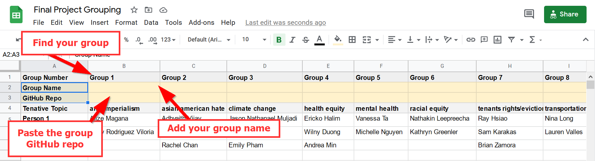

# Due Thursday 4/8:
1. Have one person create a new repo for the group and invite everyone as collaborators. 
- [Guide on how to create a new repo and invite](../Guides/git_creating.md) 
1. Add a `readme.md` to the repository that describes the following:
   - What social problem is being addressed, - The local community or non-profit that is being empowered by your application
   - What problems you think may arise in developing this application (both technical and ethical).
   > Note: This is your group's introduction to the world, make sure you use [Markdown formatting](https://guides.github.com/features/mastering-markdown/) to style your content properly.  
2. Add your group name and repo link to the Google Sheet here: 
[https://docs.google.com/spreadsheets/d/1B5QTtB3iDFuOXT3z6kv1Dwr1eNku9AeVAHF55YEZXFs/edit#gid=0](https://docs.google.com/spreadsheets/d/1B5QTtB3iDFuOXT3z6kv1Dwr1eNku9AeVAHF55YEZXFs/edit#gid=0)

**Extra Credit**: Reach out to a non-profit organization that your crowd-sourced mapping application could help support and incorporate them into the write-up.
