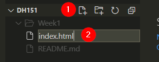

# Lab 2: Hello World (of HTML, Javascript, CSS, and Leaflet mapping!)

>### Lab Objectives:
> - Create a basic webpage 
> - Add a Leaflet map
> - Add data to the map

## Let's get VS Coding!
Start up VS Code and open your Assignments repo:

We are creating a webpage from scratch together, so let's start by creating a create a new file.

1. Make sure Explorer is open by clicking on it:

2. Click on the "new file" button:
   
3. 
