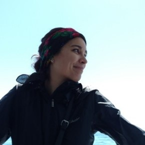

# Week 2 - Humanizing Technology: Critical Cartography

## Lecture
- [Lecture 2 Slides](./Materials/AA191_S_W2_Lecture_2.pdf)
- [Lecture 2 Recording](https://ucla.zoom.us/rec/share/_V2Kuo3bcJi99D8jtrDPdz_2m8_n6cOtgqXGHH-Ezmkx3HBkjKb4ufgHThJE48XU.45krM3bcMnHLfTHf)
- [Discussion questions](https://docs.google.com/document/d/10nwVUy8EigpqCpTYV1ZZI86MuBjHWnAHLWkuYlnaBAo/edit?usp=sharing
)
- [Mini-Lab: Creating a repo!](../Guides/git_creating.md)
### Visiting Voices: Mariah Tso

Mariah Tso is a Diné woman, artist, and GIS Specialist for the [Ralph J. Bunche Center](https://bunchecenter.ucla.edu/) and the [Million Dollar Hoods Project](https://milliondollarhoods.pre.ss.ucla.edu/). 

## Lab
- [Hello World (of HTML, Javascript, CSS, and Leaflet mapping!)](./Lab/readme.md)
<!-- - -->
- [Lab Slides](./Materials/AA191_S_W2_Lab_2.pdf)
- [Lecture 2 Recording](https://tinyurl.com/2rrm77u8)

## Assignments
### Due Thursday 4/8:
- [Pre-Lab](./Materials/pre-lab.md)
- [Group Assignment #1](../Week_1/3_group_project.md)
- [Lab Assignment #1](https://github.com/albertkun/21S-ASIAAM-191A-Assignments/tree/main/Week_01)

### Due Sunday 4/11 at 12am PST:
- [Thinking Cap #2](https://github.com/albertkun/21S-ASIAAM-191A/discussions/47)

### Due Tuesday 4/13:
- Weekly reading
  - [Chambers, R. (2006) Participatory Mapping and Geographic Information Systems: Whose map? Who is empowered and who is disempowered? Who gains and who loses?](https://onlinelibrary.wiley.com/doi/epdf/10.1002/j.1681-4835.2006.tb00163.x)
- [Thinking Cap #2 Comments ](https://github.com/albertkun/21S-ASIAAM-191A/discussions/categories/week-2)

### Due Thursday 4/15:
- [Lab Assignment #2](Week_2\Materials\lab_assignment_2.md)

### Due Tuesday 4/20:
- [Group Assignment #2](Week_2\Materials\group_assigment_2.md)

#### Optional: Git Resources for command-line

- **Easy to read and understand:**
http://www-cs-students.stanford.edu/~blynn/gitmagic/ch02.html

- **Super thorough:**
https://github.com/k88hudson/git-flight-rules/
