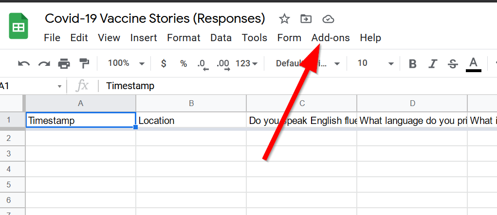
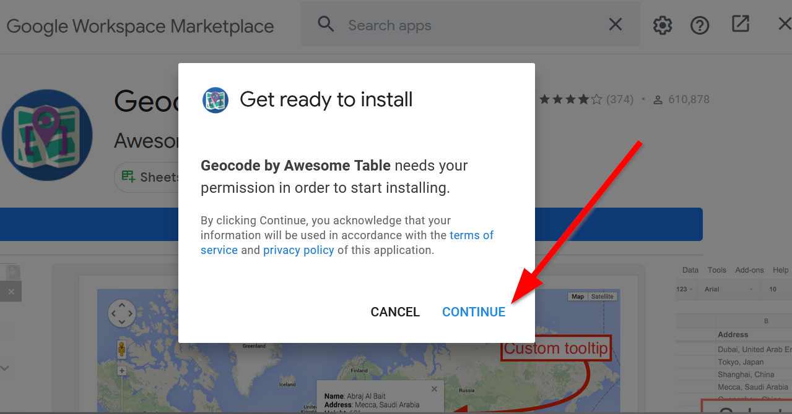
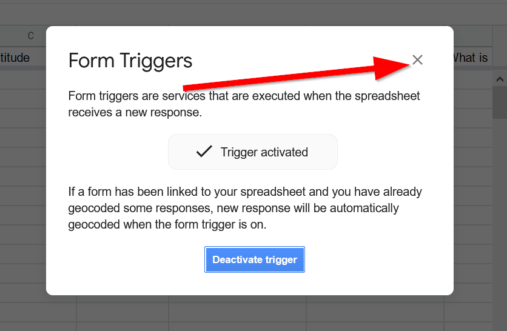
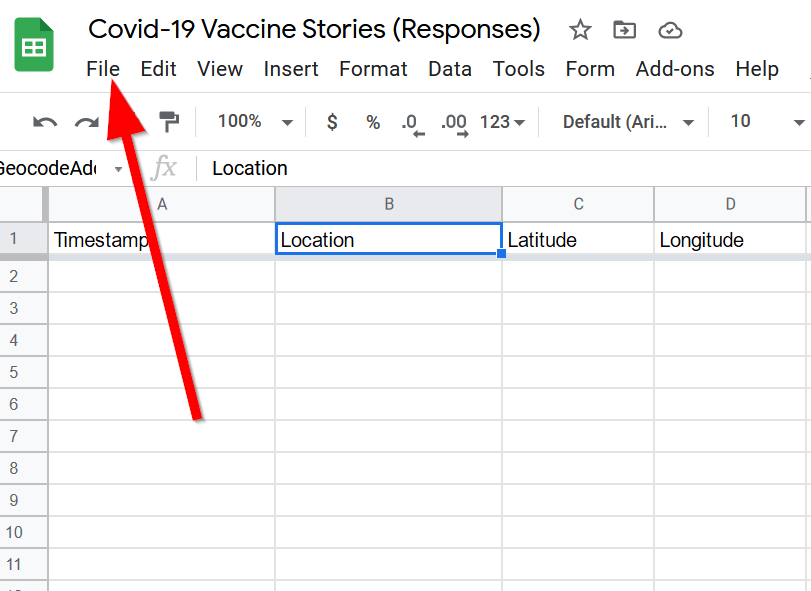
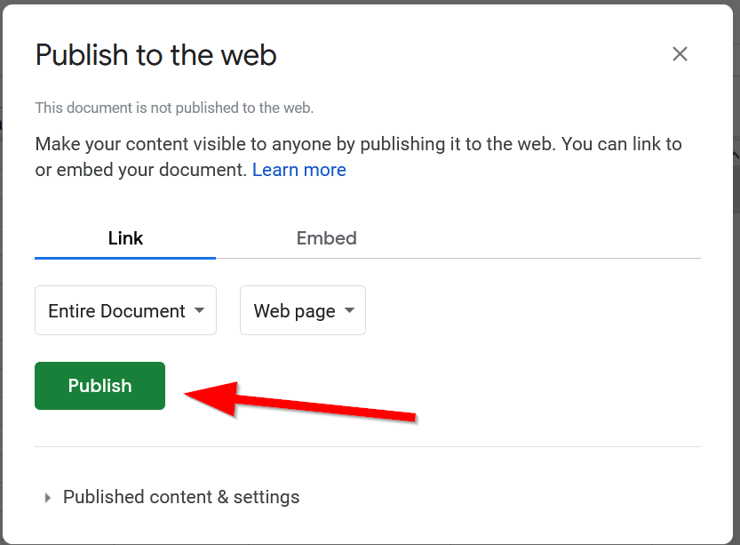
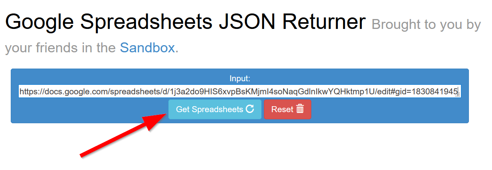
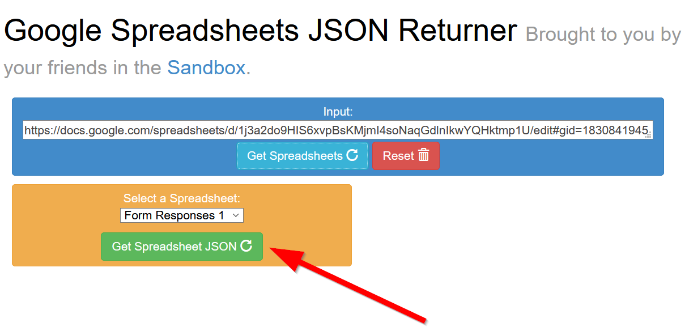

## Automatic Geocoding for "Free"
Now we will perform a geocode (putting Latitude and Longitude to named places) on the location after each time it is run. To make things easier, we will need to install an add-on for this.

Click on Add-ons:

Click on Get add-ons:

Search for `Geocode by Awesome Table`

Click the the button to open the add-on installation:

Click install:

Click continue to sign-in with Google:

Choose the account to give access to the geocoder add-on:

Allow the permissions (be sure to read what it allows first):

After the installation is done, go to `Add-ons` in the menu:

Click on the `Geocode by AwesomeTable` and select `Start Geocoding`

Click the column under the `address` column, it defaults to the first column:

Choose the `location` column:

Click the `Geocode!` button:

In the add-on menu for Geocode by Awesome Table, choose `Geocode on Form Submit`

Activate the trigger: 

Close the window:



## Publishing the survey
Now that our data is able to be geocoding, we can bring it into our HTML file through JavaScript. But first we have to publish the spreadsheet:

Go to file:

Click on `Publish to web`:

Click on `Publish`:

Copy the URL in the address bar:


Go to this website:
[https://sandbox.idre.ucla.edu/tools/gsJson/](https://sandbox.idre.ucla.edu/tools/gsJson/)
Paste the URL in:

Click the button, `Get Spreadsheets`:

Click the button, `Get Spreadsheets JSON`:

Copy the results:


In the `init.js` file paste the entire result into the `URL` variable:

> js/init.js
```js
let url = "https://spreadsheets.google.com/feeds/list/1j3a2do9HIS6xvpBsKMjmI4soNaqGdlnIkwYQHktmp1U/oua1awz/public/values?alt=json"
fetch(url)
	.then(response => {
		return response.json();
		})
    .then(data =>{
        console.log(data)
    }
```
In your console, you should now see the Google Spreadsheet data when some one enters information.