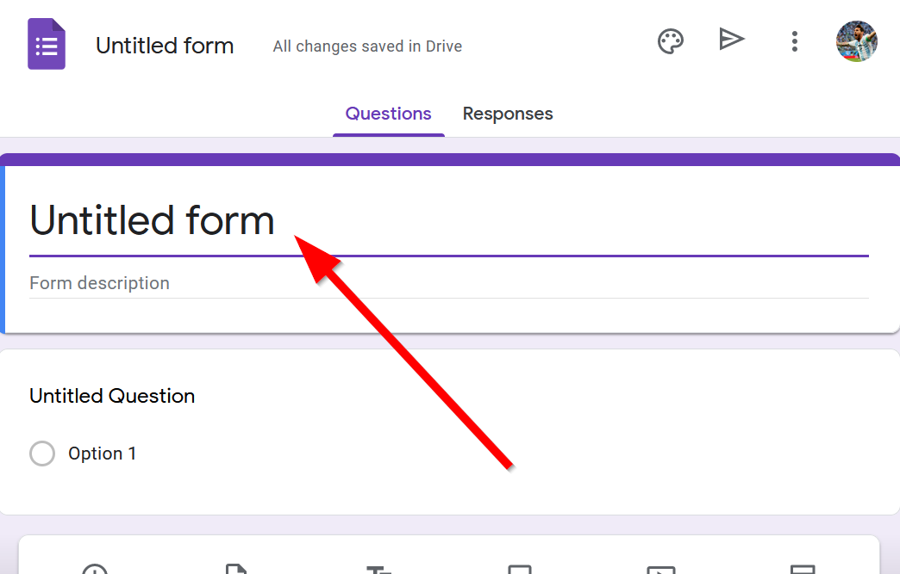
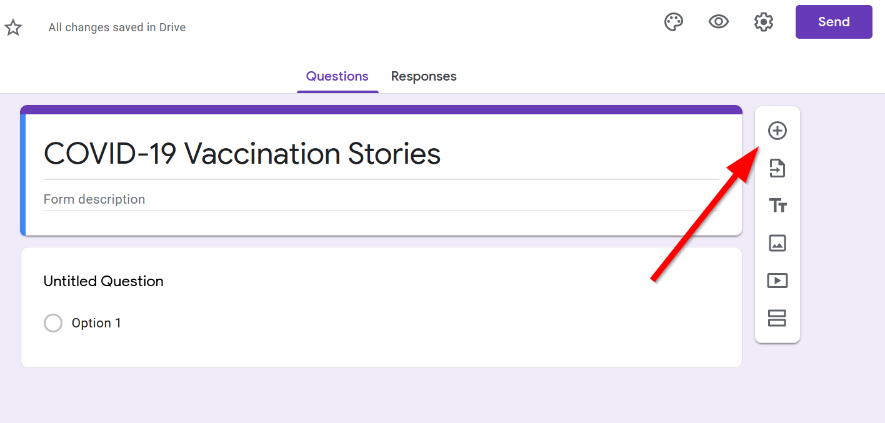
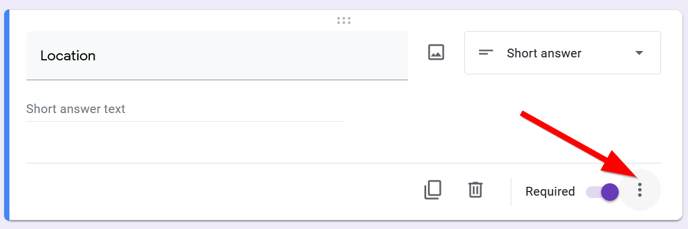
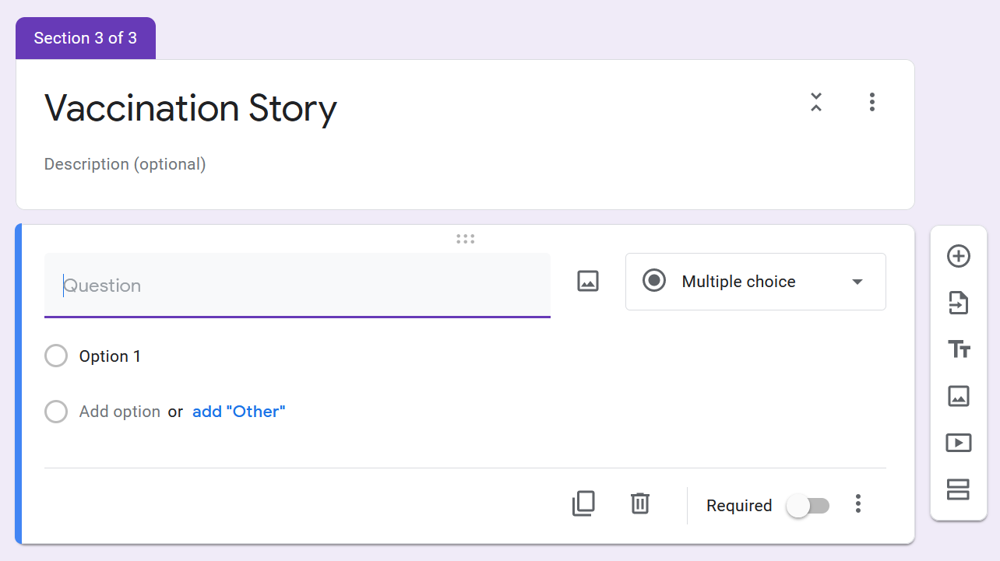
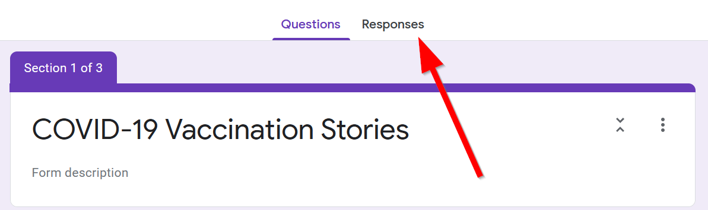
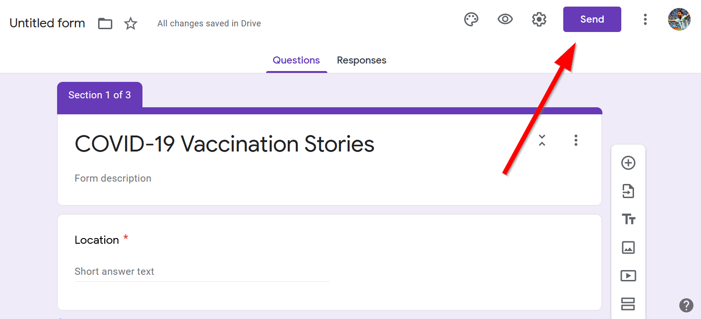
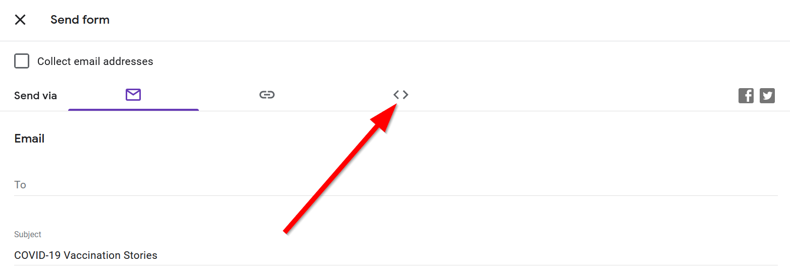

# Meaningful Survey Design

>### Objectives:
> - Understand how to create a Google form with meaningful questions
> - Know how to embed a Google Form into a website

> ### Bonus:
> - Use Microsoft Forms and Flow to connect a translated form to Google Sheets.

Start by creating a week4 folder in your lab assignments repo.

Create a new html page called `index.html` and add this code:
> index.html
```html
<!DOCTYPE html>
<html>
    <head>
        <title>Basic Leaflet Map</title>
        <meta charset="utf-8" />
        <link rel="shortcut icon" href="#">
        <link rel="stylesheet" href="style/style.css">

        <!-- Leaflet's css-->
        <link rel="stylesheet" href="https://unpkg.com/leaflet@1.7.1/dist/leaflet.css" />

        <!-- Leaflet's JavaScript-->
        <script src="https://unpkg.com/leaflet@1.7.1/dist/leaflet.js"></script>
    </head>
    
    <body>
        <div id="map"></div>
        <div id="survey">
        <!-- put the survey in here! -->
        </div>
        <script src="js/init.js"></script>
    </body>
</html>
```
Create a `style` folder and create this `style.css`:
>style/style.css
```css
    body{
        display:grid;
        grid-template-columns: 1fr 1fr; /* this creates an even two column layout*/
        grid-template-areas: "mappanel sidepanel" /* this creates one row with map panel on the left and sidepanel on the right */
    }

    #map{
        height:90vh;
        grid-area: mappanel;
    } 

    #survey{
        grid-area: sidepanel;
    } 
```
Create a `js` folder and create this `init.js`:
>js/init.js
```js
const map = L.map('map').setView([34.0709, -118.444], 5);

L.tileLayer('https://{s}.tile.openstreetmap.org/{z}/{x}/{y}.png', {
    attribution: '&copy; <a href="https://www.openstreetmap.org/copyright">OpenStreetMap</a> contributors'
}).addTo(map);

let url = "GIVE_ME_A_URL"
fetch(url)
	.then(response => {
		return response.json();
		})
    .then(data =>{
        console.log(data)
    })
```

## Creating a new Google Form
Navigate to Google Forms and click on "Blank":


Give a title to your Google Form by clicking on "Untitled Form":


Add a little description about the survey form here. For our example we will be collecting stories about vaccinations during COVID-19.

## Adding a Google Form Question

Click on the "Add Question" button to add a question:


Start typing "Location" and Google will automatically guess the question type for you. 


You can fill in descriptions below the question to help with answering by clicking on the "more" triple dots:


Then going to description:


And typing out a help description:


You can check the "required" mark to make this question necessary to move on.


## Conditional Questions

Add a relevant question to help guide the user about the survey, `Do you speak English fluently`?"`


Click on the `triple dots`:


Select `Go to section based on answer`:


## Adding new sections

Add a new section:


Title it `Language Details`


Add one question on `What language do you primary speak at home`?


And another on `What is your age`?


Go back to the question `Do you speak English fluently?` and for `No`:


Choose `Go to Section 2`.


Scroll to the bottom and add a new section:


Call it `Vaccination Story` and add a new question:



Add the question:
>`Would you be comfortable with sharing your story?`
> - Yes
> - No

Make it a required question.

#### Bonus: Feel free to make it branch here, so if some one chooses "No" they submit the form and finish.

Class exercise:

Add two open-ended questions:

> How did you make the appointment? 

> How did you get to the location?

Make sure they are both `Paragraph` answer types:


## Wrapping the form up

Go back to `Do you speak English fluently` and make `Yes` go to `Section 3`:


Your final form should look something like this:
https://forms.gle/E8xBqKLJNJyvxGcK8

Click on `Responses`:

Click on the Google Spreadsheet button:


Change the title and click on `Create` button:

Open the connected Google Form:


Click here to share your form:


Click on the "embed" tab:



Copy the Embeded HTML by clicking the button:


Go back to `index.html` and paste the embedded HTML into the survey div:
```html
<div id="survey">
    <iframe src="https://docs.google.com/forms/d/e/1FAIpQLSdqVT10bEbUrULMu6Etwj4ZBXGf-LAxcKohAINFbIdZmHS6OA/viewform?embedded=true" width="640" height="654" frameborder="0" marginheight="0" marginwidth="0">Loading…</iframe>
</div>
```
## Accessing the Responses
Click on responses:


Click on the Google Spreadsheet button:


Click on create:


Open the response Google Sheet by clicking open or the Google Sheets icon:


This is your survey reponses.

## Advanced: Multi-Language Support

#### Google Forms

Unfortunately, Google Forms has poor native support when it comes to multi-language support. You can see that the `required`, `other`, and `date` fields are all in English.

#### Microsoft Forms


Microsoft Forms has much better localization in that regard, but the workflow is more tricky to set up.  
> ### Note: Regardless of Google Forms or Microsoft Forms you still have to translate the surveys manually yourself!

### MS means more complicated
To use [MS Forms](https://forms.office.com/) you need to activate your UCLA Office365 account:
[https://help.bol.ucla.edu/kb_view.do?sysparm_article=KB0012869](https://help.bol.ucla.edu/kb_view.do?sysparm_article=KB0012869)

Once you do get your Microsoft Form up and running, you will be sending the information from MS Form into a Google Sheet so you still need to know how to use the Geocoder add-on! 

### One more extra step...

To connect the data to Google Sheets, you need to use  [Microsoft Flow](https://us.flow.microsoft.com/en-us/) which is an automation tool. Here's the method showing how to connect [MS Flow to MS Forms and Google Sheets](https://powerusers.microsoft.com/t5/General-Power-Automate/Flow-Forms-to-Google-Sheet/td-p/426174)

In the end, your group should ask yourself if it's worth it. 

But here's some example surveys I made using Microsoft Forms (using Google Translate for the Korean, Chinese versions):

[English](https://forms.office.com/Pages/ResponsePage.aspx?id=wUQc6jN2B0Oi-R8ZVsbkG_LXpxHsmdxLimldlDbJZC9URDVTRkswUUxCSUxRV005U0lQNFlZOTM1MC4u)

[Korean](https://forms.office.com/Pages/ResponsePage.aspx?id=wUQc6jN2B0Oi-R8ZVsbkG_LXpxHsmdxLimldlDbJZC9URDVTRkswUUxCSUxRV005U0lQNFlZOTM1MC4u&lang=ko)

[Chinese](https://forms.office.com/Pages/ResponsePage.aspx?id=wUQc6jN2B0Oi-R8ZVsbkG_LXpxHsmdxLimldlDbJZC9URDVTRkswUUxCSUxRV005U0lQNFlZOTM1MC4u&lang=zh-cn)

[Japanese](https://forms.office.com/Pages/ResponsePage.aspx?id=wUQc6jN2B0Oi-R8ZVsbkG_LXpxHsmdxLimldlDbJZC9URDVTRkswUUxCSUxRV005U0lQNFlZOTM1MC4u&lang=ja)

In Microsoft Forms to get the form to show up in the language, you have to do a bit of snooping around to change the URLs to specify the language here is the a table representing the most common ones:

|Language |Extra Code|
--- | --- |
|Korean|&lang=ko|
|Spanish|&lang=es-mx|
|Chinese (Simplified)|&lang=zh-cn|
|Chinese (Traditional)|&lang=zh-tw|
|Japanese|&lang=ja|

