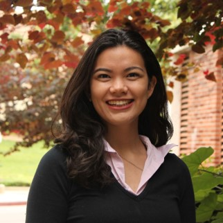

# Week 4 - Developing for Civil Society
[Check out the new course "Weeky" if you are having trouble finding assignments.](https://github.com/albertkun/21S-ASIAAM-191A/wiki)
## Lecture
- [Developing for civil society](./Materials/AA191_S_W4_Lecture_4.pdf)
- [Nina Kin- Lessons Learned in Building Tech For Good](https://docs.google.com/presentation/d/17qQyfPciNF09fCtEwmsR0uPNbs3RbDqts9StZQLXMfg/edit#slide=id.gcddf4fe401_0_237)
- [Carolanne Link- Empowering Narratives: How Not to F@#$ It Up](https://docs.google.com/presentation/d/1jPcFWoSd7HCX6y9TwKmsyjbhD-CWNpKhJSH8Km6B34E/edit#slide=id.p)

Recordings can now be found here: https://tinyurl.com/eb6pyw3k

## Lab
- [Meaningful Survey Design Lecture](./Materials/AA191_S_W4_Lab_4.pdf)
- [Meaningful Survey Design](Lab/readme.md)

### Visiting Voices: Nina Kin

[Nina Kin](http://www.ninakin.com/) works as the [Technical Lead at Los Angeles Metro](https://developer.metro.net/api/) and active in spaces of civic tech and mapping. Contact: [KinN@metro.net](KinN@metro.net)

### Visiting Voices: Carolanne Link

Carolanne Link is the Project Manager for the [UCLA Web Accessibility Initiative](https://dcp.ucla.edu/uwai/) and is a disability advocate. Contact: [clink@oarc.ucla.edu](clink@oarc.ucla.edu)

## Assignments
### Due Thursday 4/22:
- [Lab Assignment #3](https://github.com/albertkun/21S-ASIAAM-191A/wiki/Lab-Assignment-3)

- [Group Assignment #2](../Week_3/Materials/../../Week_2/Materials/group_assigment_2.md)

- [Pre-lab Readings](./Materials/pre-lab.md)

### Due Tuesday 4/26:
Readings:
- https://handsondataviz.org/guiding.html
- https://handsondataviz.org/public.html

## Extra Credit Assignments 
### Due Thursday 4/22:
- [Coded Bias viewing](https://github.com/albertkun/21S-ASIAAM-191A/discussions/91)
  
### Due Tuesday 4/26:
- [Extra Thinking Cap](https://github.com/albertkun/21S-ASIAAM-191A/discussions/122)
