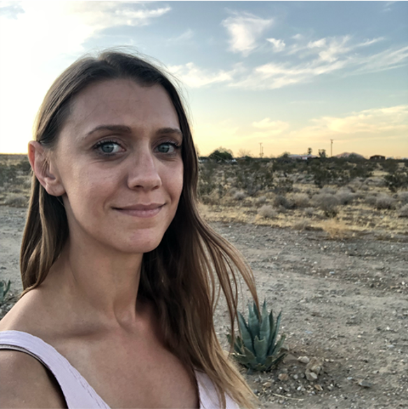

# Week 5 - Society, Technology, and Ethics

## Lecture
- [Connecting the dots of technology and ethics](./Materials/AA191_S_W5_Lecture_5.pdf)

Recordings can now be found here: https://tinyurl.com/eb6pyw3k

## Lab
- [Loops and APIs](./Lab/readme.md)

### Visiting Voices: Adriane Hoff 

[Adriane Hoff](https://twitter.com/hoffbeatenpath) is the out-going president of the [Wilshire Center Koreatown Neighborhood Council (WCKNC)](https://wcknc.la/) and community activist. She is also on the steering committee on [Streets For All](https://streetsforall.org/), a transportation advocacy group in Los Angeles.

## Assignments
### Due Thursday 4/29:

- [Group Assignment #3](../Week_4/Materials/Group_Assignment_3.md)

### Due Tuesday 5/4:
- [Thinking Cap #5](https://github.com/albertkun/21S-ASIAAM-191A/discussions/133)

#### Readings:
1. [Crampton, J. (1995) The Ethics of GIS.](./Materials/CramptonCaGISEthics1995.pdf)
2. [Marx, P. (2020) Don’t Blame Social Media. Blame Capitalism.](https://www.jacobinmag.com/2020/09/social-media-platform-capitalism-the-social-dilemma)

### Due Thursday 5/6:
- [Lab Assignment #4](./Lab/lab_assignment.md)
- [Group Assignment #4](./Materials/group_assignment_4.md)

## Extra Credit Assignment
### Due Tuesday 5/4:
- [Extra Reading Response](https://github.com/albertkun/21S-ASIAAM-191A/discussions/132)
