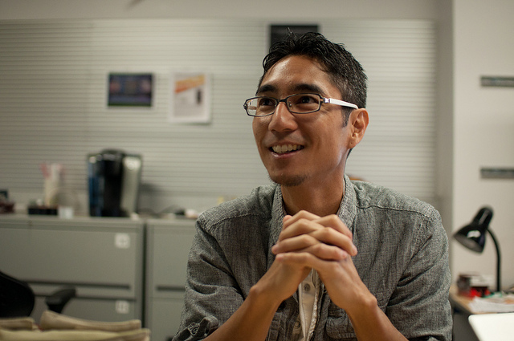

# Week 6 - Human-Centered Design

## Lecture
- [Designing for Civil Society](./Materials/AA191_S_W6_Lecture_6.pdf)

Recordings can now be found here: https://tinyurl.com/eb6pyw3k

## Lab
-  [Design DeciCSSions](./Lab/)
-  [Lab Slides](./Materials/AA191_S_W6_Lab_6.pdf)

### Visiting Voices: Yoh Kawano 

[Yoh Kawano](https://twitter.com/yohman) is a research coordinator at UCLA’s [Institute for Digital Research and Technology](https://idre.ucla.edu/people/yoh-kawano). His community empowerment is on narratives in Japan’s Fukushima prefecture following the 2011 Tsunami. 

Email: [yohman@gmail.com](mailto:yohman@gmail.com)

## Assignments

### Due Thursday 5/6:
- [Lab Assignment #4](../Week_5/Lab/lab_assignment.md)
- [Group Assignment #4](../Week_5/Materials/group_assignment_4.md)
- [Pre-lab](./Materials/pre-lab.md) 

### Due Tuesday 5/11:
- [Thinking Cap #6](https://github.com/albertkun/21S-ASIAAM-191A/discussions/144)
  
### Due Thursday 5/13:
- [Lab Assignment #5](./Lab/lab_assignment.md)

#### Readings:
1. [Costanza-Chock, S. (2018) Design Justice.](./Materials/Design_Justice.pdf)
