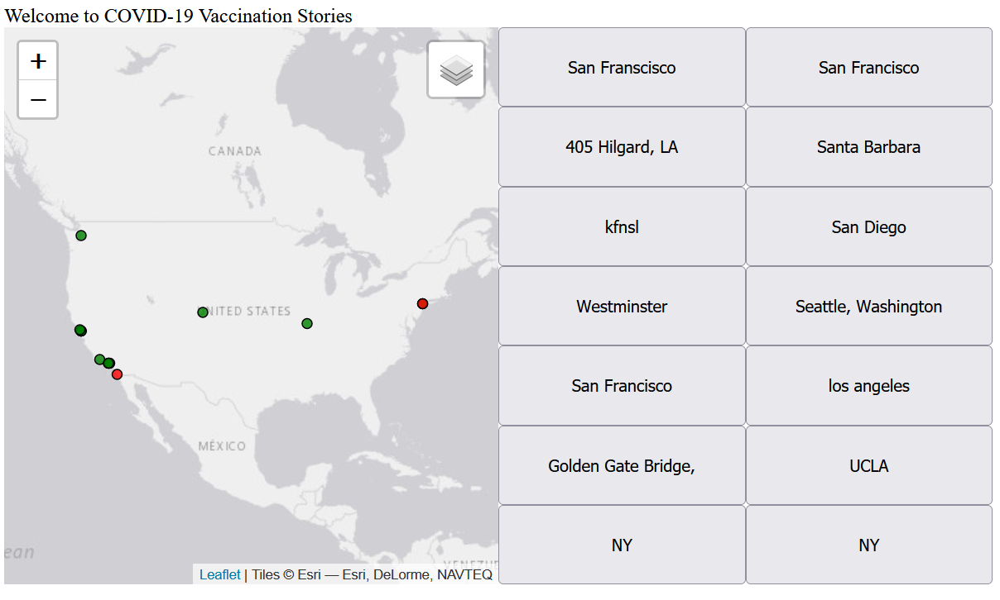
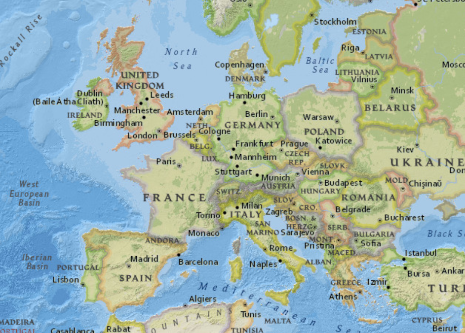
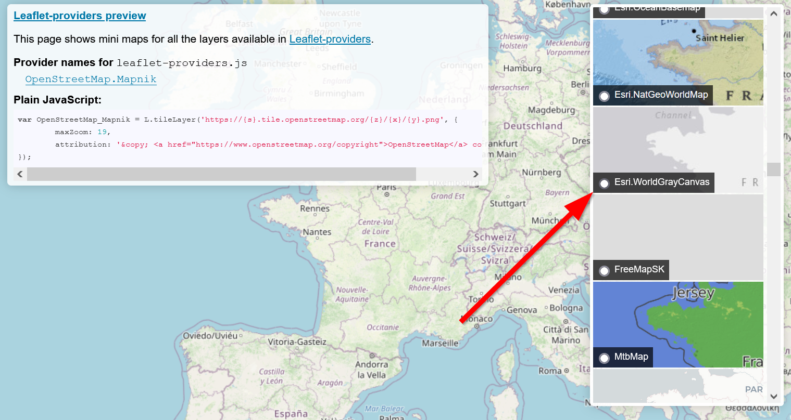
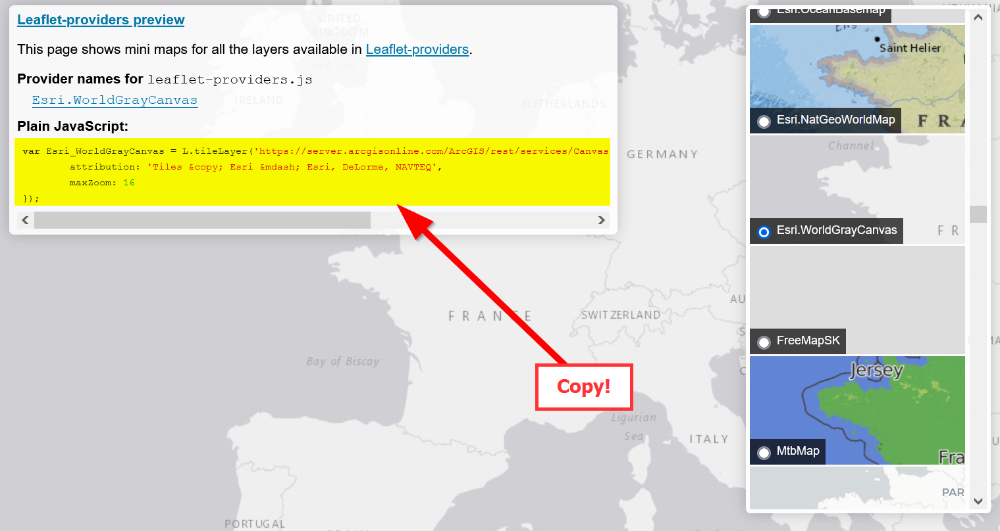

# Map Layers and Visual Design
### Objectives:
- Use conditional statements to add content into Leaflet `FeatureGroups`
- Use Leaflet's `circleMarkers` to visualize points
- Change the basemap for our maps

Today we will focus on styling our map through the use of Leaflet [`Feature groups`](https://leafletjs.com/reference.html#featuregroup), which means more JavaScript!

`Feature groups` are like boxes that you can use to group your map content. For this lab we will be creating two layers for our survey question of `Do you speak English fluently?`

One group will be for `yes` and another group for `no`.

### Our goal today:


## Setup

Start by creating a `week_6` folder in your assignments repo.

> ### Optional: If you want to work with your own layout, you can copy the contents of your `week_5` folder and skip the following setup section.

### Boiler Plate code
Create the following files:
> index.html
``` html
<!DOCTYPE html>
<html>
    <head>
        <title>COVID-19 Vaccination Stories</title>
        <meta charset="utf-8" />
        <link rel="shortcut icon" href="#">
        <link rel="stylesheet" href="styles/style.css">

        <!-- Leaflet's css-->
        <link rel="stylesheet" href="https://unpkg.com/leaflet@1.7.1/dist/leaflet.css" />

        <!-- Leaflet's JavaScript-->
        <script src="https://unpkg.com/leaflet@1.7.1/dist/leaflet.js"></script>
    </head>
    
     <body>
        <header>Welcome to COVID-19 Vaccination Stories</header>
        <div id="contents"></div>
        <div id="map"></div>
        <div id="survey">
            <iframe src="https://docs.google.com/forms/d/e/1FAIpQLSdqVT10bEbUrULMu6Etwj4ZBXGf-LAxcKohAINFbIdZmHS6OA/viewform?embedded=true" width="640" height="654" frameborder="0" marginheight="0" marginwidth="0">Loading…</iframe>
        </div>
        <script src="js/init.js"></script>
    </body>
</html>
```

> js/init.js
```js
const map = L.map('map').setView([34.0709, -118.444], 5);

const url = "https://spreadsheets.google.com/feeds/list/1upD99bKWIO68jL8MKWV67KE-_H_TVn2bCwqyQkqNsBw/oxw5dh3/public/values?alt=json"

L.tileLayer('https://{s}.tile.openstreetmap.org/{z}/{x}/{y}.png', {
    attribution: '&copy; <a href="https://www.openstreetmap.org/copyright">OpenStreetMap</a> contributors'
}).addTo(map);

fetch(url)
	.then(response => {
		return response.json();
		})
    .then(data =>{
                // console.log(data)
                formatData(data)
        }
)

function addMarker(data){
    L.marker([data.lat,data.lng]).addTo(map).bindPopup(`<h2>${data.timestamp}</h2>`)
    createButtons(data.lat,data.lng,data.location)
    return data.timestamp
}

function createButtons(lat,lng,title){
    const newButton = document.createElement("button");
    newButton.id = "button"+title;
    newButton.innerHTML = title;
    newButton.setAttribute("lat",lat); 
    newButton.setAttribute("lng",lng);
    newButton.addEventListener('click', function(){
        map.flyTo([lat,lng]);
    })
    const spaceForButtons = document.getElementById('contents')
    spaceForButtons.appendChild(newButton);
}

function formatData(theData){
        const formattedData = []
        const rows = theData.feed.entry
        for(const row of rows) {
          const formattedRow = {}
          for(const key in row) {
            if(key.startsWith("gsx$")) {
                  formattedRow[key.replace("gsx$", "")] = row[key].$t
            }
          }
          formattedData.push(formattedRow)
        }
        console.log(formattedData)
        formattedData.forEach(addMarker)        
}
```

>styles/style.css
```css
body{
    display: grid;
    grid-template-columns: 1fr 1fr; 
    grid-auto-rows: minmax(5px, auto);
    grid-template-areas: "header header" "mappanel sidebar" 
}

header{
    grid-area: header;
}

#map{
    height:90vh;
    grid-area: mappanel;
} 

#contents{
    grid-area: sidebar;
    display:grid;
    grid-template-columns: repeat(2, 1fr);
}

/* fix for survey to fit in the iframe */
#survey {
    overflow: hidden;
    /* 16:9 aspect ratio */
    padding-top: 0%;
    position: relative;
}

#survey iframe {
   border: 0;
   height: 100%;
   left: 0;
   position: absolute;
   top: 0;
   width: 100%;
}
```
## `if-else` Conditional Statements
Conditional statements are important for being able to tell our code to do or not do something. The syntax for `if-else` statments are similar to `for-loop` in that they look like this:

```js
const hello = "hi"
if (hello){
    // do something
    // optional: return something
} 
```
The `if` is a keyword that evalutes the condition within the `()`. 
There are different ways to set `conditions` inside the `()`, but it must has to either be `true` or `false`. 

Here are some examples:

Example | Meaning
--|--
`if(variable)`| Does this `variable` exist?
`if(variable == "yes")` | Does this `variable` equal to "yes"
`if(variable != "yEs")` | Does this `variable` NOT equal "yEs"
`if(variable > 10 )` | Is this `variable` greater than 10?
`if(variable == false)` | Is this `variable` false?
`if(variable == null)` | Is this `variable` null?
`if(variable == anotherVariable)` | Is this `variable` the same as another variable?
`if(variable > 1 && variable < 10)` | Is this `variable` greater than 1 **AND** is `variable` less than 10?

You can check this MDN article on `truthy` and `falsy` for more examples:

- https://developer.mozilla.org/en-US/docs/Glossary/Truthy
- https://developer.mozilla.org/en-US/docs/Glossary/Falsy

The `&&` is a logical `AND` operator where all statements have to be `True` in order to be statisfied.

- https://developer.mozilla.org/en-US/docs/Web/JavaScript/Reference/Operators/Logical_AND

#### Great, what `else` is there?

`else` acts like a default in case the `if` condition never is true:
```js
const hi = "uh oh!"
if (hello && hi){
    // do something IF `hello` and `hi` exist
}
else {
    // do something else
}
```

### Class Exercise #1: Let's see `IF` you get the idea!
Create an `if-else`statement for the dataset in your mapplication within the `addMarker()` function to only add markers when a certain condition exists:

```js
function addMarker(data){
    L.marker([data.lat,data.lng]).addTo(map).bindPopup(`<h2>${data.timestamp}</h2>`)
    createButtons(data.lat,data.lng,data.location)
    return data.timestamp
}
```

If you are using the lab dataset, filter out answers to the question`"Do you speak English fluently?"`

 **Bonus: Can you use an `else` statement to show the number of those who speak other languages?**
<details>
<summary><b>Answer</b></summary>

```js
function addMarker(data){
    if(data.doyouspeakenglishfluently == "Yes"){
        L.marker([data.lat,data.lng]).addTo(map).bindPopup(`<h2>Speaks English fluently</h2>`)
        createButtons(data.lat,data.lng,data.location)
    }
    else{
        L.marker([data.lat,data.lng]).addTo(map).bindPopup(`<h2>Speak other languages</h2>`)
        createButtons(data.lat,data.lng,data.location)   
        // Bonus:    
        // speakOtherLanguage += 1
    }
    return data.timestamp
}
// let speakOtherLanguage = 0
//window.onload = function afterWebPageLoad() { 
    //document.body.append("Number of hidden records:"+speakOtherLanguage)
```
</details>

## Leaflet `featureGroups`
A `feature group`, which is Leaflet's container for dealing with multiple groups of data layers.

In our `js/init.js` file we will add some variables to store our groups in: 
```js
let speakFluentEnglish = L.featureGroup();
let speakOtherLanguage = L.featureGroup();
```
 Important!!! These variables have to be OUTSIDE the function, because `Leaflet` needs to be able to use them. A variable outside of a function is said to be in the `global scope`.

 Next we will need to change our `addMarker` function to add each marker to their respective groups instead of just directly onto the map:

```js
// our Leaflet feature group layers waiting for content!
let speakFluentEnglish = L.featureGroup();
let speakOtherLanguage = L.featureGroup();

function addMarker(data){
    if(data.doyouspeakenglishfluently == "Yes"){
        speakFluentEnglish.addLayer(L.marker([data.lat,data.lng]).addTo(map).bindPopup(`<h2>Speak English fluently</h2>`))
        createButtons(data.lat,data.lng,data.location)
        }
    else{
        speakOtherLanguage.addLayer(L.marker([data.lat,data.lng]).addTo(map).bindPopup(`<h2>Speak other languages</h2>`))
        createButtons(data.lat,data.lng,data.location)
    }
    return data.timestamp
}
```
Awesome! Now let's see our beautiful layers!

 We also need to delete the line `.addTo(map)` after each marker, because we will add the `featureGroup` to the map instead of individual markers:

```js
// our Leaflet feature group layers waiting for content!
let speakFluentEnglish = L.featureGroup();
let speakOtherLanguage = L.featureGroup();

function addMarker(data){
    if(data.doyouspeakenglishfluently == "Yes"){
        speakFluentEnglish.addLayer(L.marker([data.lat,data.lng]).bindPopup(`<h2>Speak English fluently</h2>`))
        createButtons(data.lat,data.lng,data.location)
        }
    else{
        speakOtherLanguage.addLayer(L.marker([data.lat,data.lng]).bindPopup(`<h2>Speak other languages</h2>`))
        createButtons(data.lat,data.lng,data.location)
    }
    return data.timestamp
}
```

Wait... our markers dispearred after we did that, why?

<details>
<summary><b>Answer</b></summary>
Since we removed `addTo(map)`, we now need to add the `group layers` to to map!!
</details>

#### Adding our `group layers` to the `Leaflet` map
As alluded to in the answer above, we need to add the groupped layers to our Leaflet map. To do so, we need to add this code somewhere:

``` js
speakFluentEnglish.addTo(map)
speakOtherLanguage.addTo(map)
```

But where?

If you answered, at the end of the `formatData` function, you are correct (and sneaky if you read ahead during the lab!)!

```js
function formatData(theData){
        const formattedData = []
        const rows = theData.feed.entry
        for(const row of rows) {
          const formattedRow = {}
          for(const key in row) {
            if(key.startsWith("gsx$")) {
                  formattedRow[key.replace("gsx$", "")] = row[key].$t
            }
          }
          formattedData.push(formattedRow)
        }
        console.log(formattedData)
        formattedData.forEach(addMarker)
        speakFluentEnglish.addTo(map) // add our layers after markers have been made
        speakOtherLanguage.addTo(map) // add our layers after markers have been made  
}
```

#### Why?
We have to add our layers after the `forEach` loop finishes, otherwise the code will run only for the first marker.

### Layer Controls
One big benefit of using Leaflet FeatureGroups is that we can add `controls` to the map which allows us to turn on and off layers.

Let's add our list of layers as an `object`:
```js
// define layers
let layers = {
	"Speaks English": speakFluentEnglish,
	"Speaks Other Languages": speakOtherLanguage
}
```
The first property name is our `alias` or what the users will see, and the property key is the Leaflet `FeatureGroup` that we created earlier.

Next we will add a Leaflet `controlGroup`:

```js
// add layer control box
L.control.layers(null,layers).addTo(map)
```
You can actually turn on and off layers using buttons outside of Leaflet controls by creating a function to add and remove layers.

We can also add a `fitBounds` to our layers to make sure our map zooms into our layer:
```js
// make the map zoom to the extent of markers
map.fitBounds(speakOtherLanguage.getBounds());
```

Hmm, that only works for one layer group, so let's create a new feature group that contains all of our layers:

```js
let allLayers = L.featureGroup([speakFluentEnglish,speakOtherLanguage]);
map.fitBounds(allLayers.getBounds());     
```
That code should go at the end of our `formatData` function so it fits all of our layers and markers.

Our `formatData` function should look like the following:

```js
function formatData(theData){
        const formattedData = []
        const rows = theData.feed.entry
        for(const row of rows) {
          const formattedRow = {}
          for(const key in row) {
            if(key.startsWith("gsx$")) {
                  formattedRow[key.replace("gsx$", "")] = row[key].$t
            }
          }
          formattedData.push(formattedRow)
        }
        console.log(formattedData)
        formattedData.forEach(addMarker)
        speakFluentEnglish.addTo(map) // add our layers after markers have been made
        speakOtherLanguage.addTo(map) // add our layers after markers have been made  
        let allLayers = L.featureGroup([speakFluentEnglish,speakOtherLanguage]);
        map.fitBounds(allLayers.getBounds());
}
```

### Refactoring
Do you think there's a better way for us to create the feature groups instead of adding all this code in our `formatData` function?

<details>
<summary><b>Answer</b></summary>
Yes, we should make a function to add each of the layers!
</details>

Due to lack of time, we won't do any refactoring, so for now we will leave the inefficient way of repeating ourselves with the various `featureGroups`. But we **must** **`refactor`** our code if we want to add our own buttons to interact with the map instead of using the default Leaflet `control` functions.

#### What is refactoring?
Refactoring code is means improving code so that it is easier to understand and easier to reuse. Refactoring is important because the less we repeat ourselves or hardcode things the less mistakes our code will have when we modify it.

<details>
<summary><b>How would you refactor this code?</b></summary>
To refactor the `group layers` code you want to do the following:

1. Create an array of `layers`
2. Create a new `function` that adds layers to the map
3. Add the markers before the `if` statments and only change what needs to be altered in the pop-ups depending on the field.
4. Finally, use a `forEach` method that calls our new function  
</details>

Now that we have the pop-up change based on our fields, let's actually change how the marker looks!

## Time to Leaflet the `markers` go, and use `circleMarkers!`:

The `blue` Leaflet markers are pretty iconic to us now (pun intended). While we can change the markers to other icons, instead we will use `circle markers` because this allows us to have nice colorful markers without finding icons.

#### Adding circleMarkers
The format for adding `circleMarkers` in `Leaflet` looks like this:

`L.circleMarker(<LatLng>, <CircleMarker options>)`

The `latlng` is pretty familiar now, but the options for circleMarkers are a bit unexplored.
```js
let circleOptions = {
    radius: 4,
    fillColor: "#ff7800",
    color: "#000",
    weight: 1,
    opacity: 1,
    fillOpacity: 0.8
}
```

Add the above `circleOptions` above our `addMarker` function and change the `marker` to `circleMarker` as follows:
```js
let circleOptions = {
    radius: 4,
    fillColor: "#ff7800",
    color: "#000",
    weight: 1,
    opacity: 1,
    fillOpacity: 0.8
}

function addMarker(data){
    if(data.doyouspeakenglishfluently == "Yes"){
        speakFluentEnglish.addLayer(L.circleMarker([data.lat,data.lng],circleOptions).bindPopup(`<h2>Speak English fluently</h2>`))
        createButtons(data.lat,data.lng,data.location)
        }
    else{
        speakOtherLanguage.addLayer(L.circleMarker([data.lat,data.lng],circleOptions).bindPopup(`<h2>Speak other languages</h2>`))
        createButtons(data.lat,data.lng,data.location)
    }
    return data.timestamp
}
```
Awesome! We got `circleMarkers`! But wait.. They are all the same..

Now this is where we need to:
1. Be intentional in our design and choose colors to represent well.
2. Change the colors based on our `if-else` statement

Let's make `green` for `Yes` and `red` for `No`.

Since `circleOptions` is an object, we can change it's property value for `fillColor` when we are in the `if-else` statement.

This should go in the `if(data.doyouspeakenglishfluently == "Yes")` scope:
```js
circleOptions.fillColor = "green"
```
And this should go in the `else` scope:
```js
circleOptions.color = "red"
```

Your final colorful `addMarker` function should look like this:
```js

function addMarker(data){
    if(data.doyouspeakenglishfluently == "Yes"){
        exampleOptions.fillColor = "green"
        speakFluentEnglish.addLayer(L.circleMarker([data.lat,data.lng],exampleOptions).bindPopup(`<h2>Speak English fluently</h2>`))
        createButtons(data.lat,data.lng,data.location)
        }
    else{
        speakOtherLanguage.addLayer(L.circleMarker([data.lat,data.lng],exampleOptions).bindPopup(`<h2>Speak other languages</h2>`))
        createButtons(data.lat,data.lng,data.location)
    }
    return data.timestamp
}
```

Phew! That was a lot to go over! But now you should take sometime to think about the design choices we have to make as map makers. One important consideration is deciding on which basemap to use.

Recall the code here:

```js
L.tileLayer('https://{s}.tile.openstreetmap.org/{z}/{x}/{y}.png', {
    attribution: '&copy; <a href="https://www.openstreetmap.org/copyright">OpenStreetMap</a> contributors'
}).addTo(map);
```
Go to:
- https://leaflet-extras.github.io/leaflet-providers/preview/
And pick a basemap that you like, a simple basemap with few colors is always preferred over a **busy** basemap:

**Busy**



**Less busy**


Click on the basemap you prefer:



Copy the `plain JavaScript` in the middle:


And put the code after `map` in your `js/init.js` file:

```js
const map = L.map('map').setView([34.0709, -118.444], 5);

const url = "https://spreadsheets.google.com/feeds/list/1upD99bKWIO68jL8MKWV67KE-_H_TVn2bCwqyQkqNsBw/oxw5dh3/public/values?alt=json"

let Esri_WorldGrayCanvas = L.tileLayer('https://server.arcgisonline.com/ArcGIS/rest/services/Canvas/World_Light_Gray_Base/MapServer/tile/{z}/{y}/{x}', {
	attribution: 'Tiles &copy; Esri &mdash; Esri, DeLorme, NAVTEQ',
	maxZoom: 16
});

Esri_WorldGrayCanvas.addTo(map)

L.tileLayer('https://{s}.tile.openstreetmap.org/{z}/{x}/{y}.png', {
    attribution: '&copy; <a href="https://www.openstreetmap.org/copyright">OpenStreetMap</a> contributors'
}).addTo(map);

```
Change the `var` to `let` and be sure to add the `variable` to your map, like so:
``` js
const map = L.map('map').setView([34.0709, -118.444], 5);

const url = "https://spreadsheets.google.com/feeds/list/1upD99bKWIO68jL8MKWV67KE-_H_TVn2bCwqyQkqNsBw/oxw5dh3/public/values?alt=json"

let Esri_WorldGrayCanvas = L.tileLayer('https://server.arcgisonline.com/ArcGIS/rest/services/Canvas/World_Light_Gray_Base/MapServer/tile/{z}/{y}/{x}', {
	attribution: 'Tiles &copy; Esri &mdash; Esri, DeLorme, NAVTEQ',
	maxZoom: 16
});

Esri_WorldGrayCanvas.addTo(map)

// L.tileLayer('https://{s}.tile.openstreetmap.org/{z}/{x}/{y}.png', {
//     attribution: '&copy; <a href="https://www.openstreetmap.org/copyright">OpenStreetMap</a> contributors'
// }).addTo(map);

```
Be sure to delete or comment out the other basemap, as you don't need two basemaps!

#### Final Code

Your final code should look like the following:

>index.html
```html
<!DOCTYPE html>
<html>
    <head>
        <title>COVID-19 Vaccination Stories</title>
        <meta charset="utf-8" />
        <link rel="shortcut icon" href="#">
        <link rel="stylesheet" href="styles/style.css">

        <!-- Leaflet's css-->
        <link rel="stylesheet" href="https://unpkg.com/leaflet@1.7.1/dist/leaflet.css" />

        <!-- Leaflet's JavaScript-->
        <script src="https://unpkg.com/leaflet@1.7.1/dist/leaflet.js"></script>
    </head>
    
     <body>
        <header>Welcome to COVID-19 Vaccination Stories</header>
        <div id="contents"></div>
        <div id="map"></div>
        <div id="survey">
            <iframe src="https://docs.google.com/forms/d/e/1FAIpQLSdqVT10bEbUrULMu6Etwj4ZBXGf-LAxcKohAINFbIdZmHS6OA/viewform?embedded=true" width="640" height="654" frameborder="0" marginheight="0" marginwidth="0">Loading…</iframe>
        </div>
        <script src="js/init.js"></script>
    </body>
</html>
```
>styles/style.css
```css
body{
    display: grid;
    grid-template-columns: 1fr 1fr; 
    grid-auto-rows: minmax(5px, auto);
    grid-template-areas: "header header" "mappanel sidebar" 
}

header{
    grid-area: header;
}

#map{
    height:90vh;
    grid-area: mappanel;
} 

#contents{
    grid-area: sidebar;
    display:grid;
    grid-template-columns: repeat(2, 1fr);
}

/* fix for survey to fit in the iframe */
#survey {
    overflow: hidden;
    /* 16:9 aspect ratio */
    padding-top: 0%;
    position: relative;
}

#survey iframe {
   border: 0;
   height: 100%;
   left: 0;
   position: absolute;
   top: 0;
   width: 100%;
}
```

>js/init.js
```js
const map = L.map('map').setView([34.0709, -118.444], 5);

const url = "https://spreadsheets.google.com/feeds/list/1upD99bKWIO68jL8MKWV67KE-_H_TVn2bCwqyQkqNsBw/oxw5dh3/public/values?alt=json"

let Esri_WorldGrayCanvas = L.tileLayer('https://server.arcgisonline.com/ArcGIS/rest/services/Canvas/World_Light_Gray_Base/MapServer/tile/{z}/{y}/{x}', {
	attribution: 'Tiles &copy; Esri &mdash; Esri, DeLorme, NAVTEQ',
	maxZoom: 16
});

Esri_WorldGrayCanvas.addTo(map)

// L.tileLayer('https://{s}.tile.openstreetmap.org/{z}/{x}/{y}.png', {
//     attribution: '&copy; <a href="https://www.openstreetmap.org/copyright">OpenStreetMap</a> contributors'
// }).addTo(map);

fetch(url)
	.then(response => {
		return response.json();
		})
    .then(data =>{
                // console.log(data)
                formatData(data)
        }
)

let speakFluentEnglish = L.featureGroup();
let speakOtherLanguage = L.featureGroup();

let exampleOptions = {
    radius: 4,
    fillColor: "#ff7800",
    color: "#000",
    weight: 1,
    opacity: 1,
    fillOpacity: 0.8
}

function addMarker(data){
    if(data.doyouspeakenglishfluently == "Yes"){
        exampleOptions.fillColor = "green"
        speakFluentEnglish.addLayer(L.circleMarker([data.lat,data.lng],exampleOptions).bindPopup(`<h2>Speak English fluently</h2>`))
        createButtons(data.lat,data.lng,data.location)
        }
    else{
        exampleOptions.fillColor = "red"
        speakOtherLanguage.addLayer(L.circleMarker([data.lat,data.lng],exampleOptions).bindPopup(`<h2>Speak other languages</h2>`))
        createButtons(data.lat,data.lng,data.location)
    }
    return data.timestamp
}

function createButtons(lat,lng,title){
    const newButton = document.createElement("button");
    newButton.id = "button"+title;
    newButton.innerHTML = title;
    newButton.setAttribute("lat",lat); 
    newButton.setAttribute("lng",lng);
    newButton.addEventListener('click', function(){
        map.flyTo([lat,lng]);
    })
    const spaceForButtons = document.getElementById('contents')
    spaceForButtons.appendChild(newButton);
}

function formatData(theData){
        const formattedData = []
        const rows = theData.feed.entry
        for(const row of rows) {
          const formattedRow = {}
          for(const key in row) {
            if(key.startsWith("gsx$")) {
                  formattedRow[key.replace("gsx$", "")] = row[key].$t
            }
          }
          formattedData.push(formattedRow)
        }
        console.log(formattedData)
        formattedData.forEach(addMarker)
        speakFluentEnglish.addTo(map)
        speakOtherLanguage.addTo(map)
        let allLayers = L.featureGroup([speakFluentEnglish,speakOtherLanguage]);
        map.fitBounds(allLayers.getBounds());        
}

let layers = {
	"Speaks English": speakFluentEnglish,
	"Speaks Other Languages": speakOtherLanguage
}

L.control.layers(null,layers).addTo(map)

```

Alright! Now you should be ready to take on the lab assignment for the week!

## Lab Assignment #6 - Conditional Visual Importance
### Due 5/20
Using your assignment from `week 6`, categorize your survey data to convey a message or theme about your map.

The requirements are:
- Use at least 2 different [layer groups](https://leafletjs.com/reference.html#FeatureGroup).
- Use a [conditional `if-else` statement](https://developer.mozilla.org/en-US/docs/Web/JavaScript/Reference/Statements/if...else)
- Customize Leaflet's [`circle markers`](https://leafletjs.com/reference-1.7.1.html#circlemarker)
- Add a title or a explanation that describes what is being shown

## Submission
- Commit your changes to GitHub
- Find your `index.html` in the `Week_07` folder and copy the URL. It should look something like this:
  - https://albertkun.github.io/21S-ASIAAM-191A-Assignments/Week_07/index.html
- Paste your link as a comment in the Discussion forum for Lab Assignment #6: 
  - https://github.com/albertkun/21S-ASIAAM-191A/discussions/148
