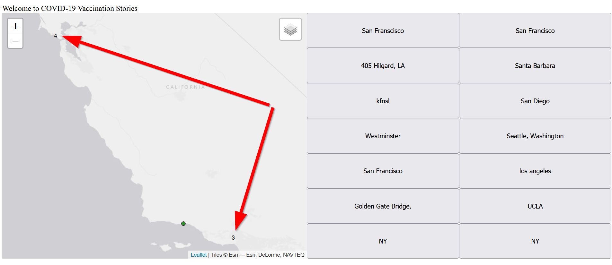
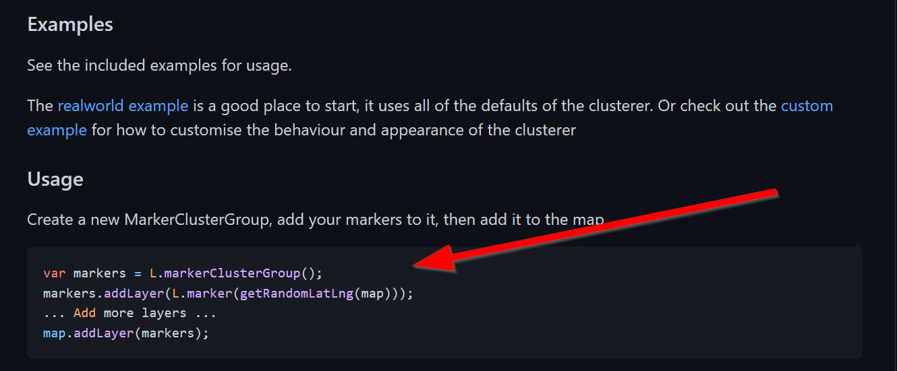
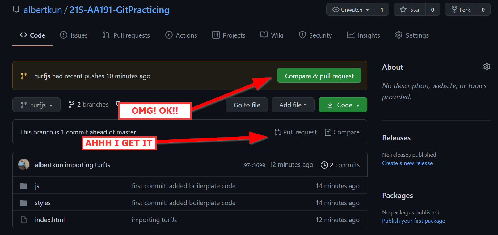
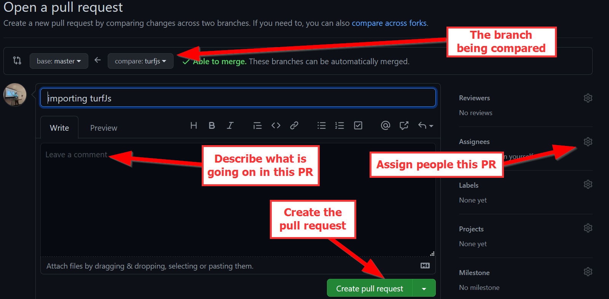
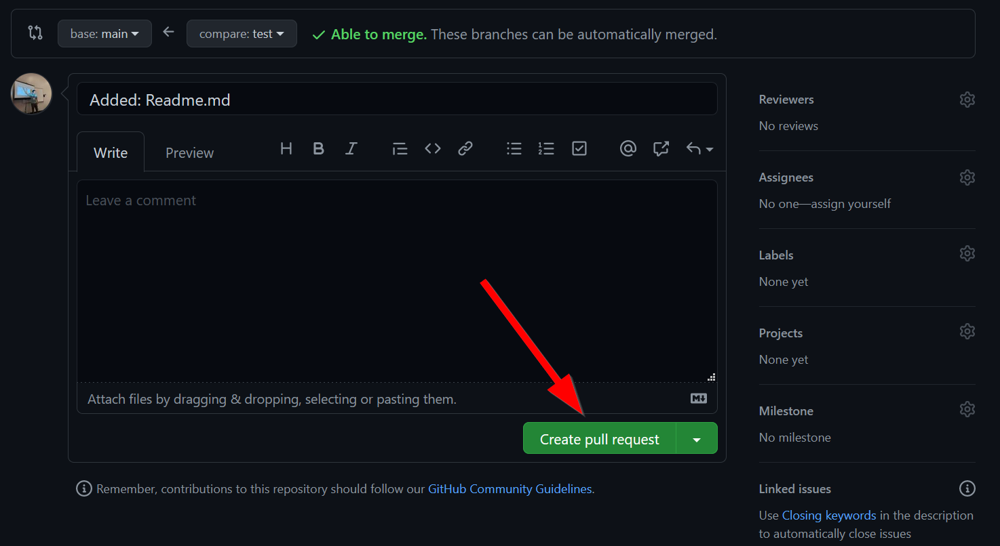
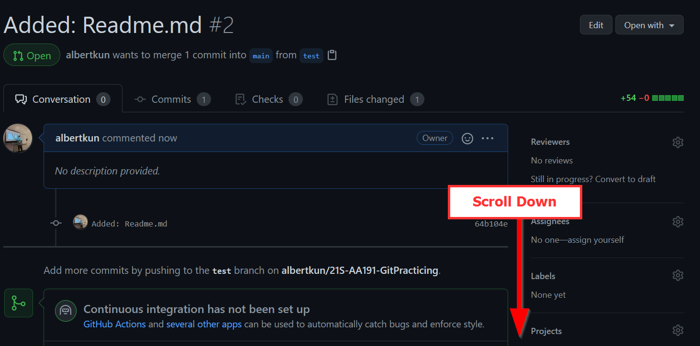
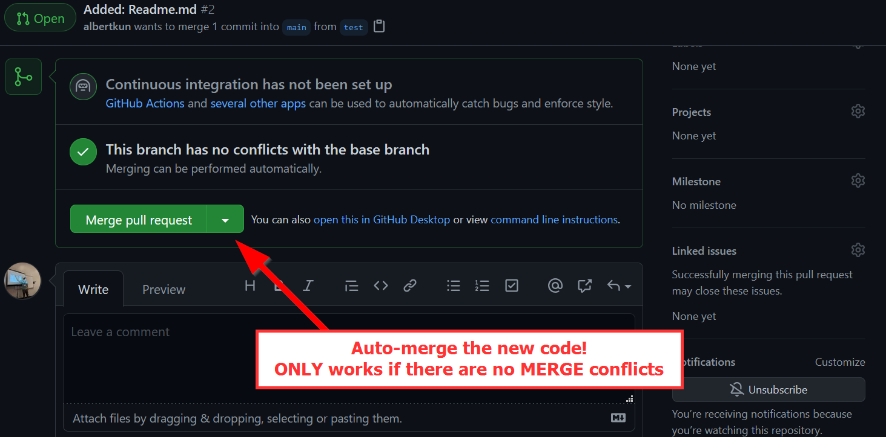
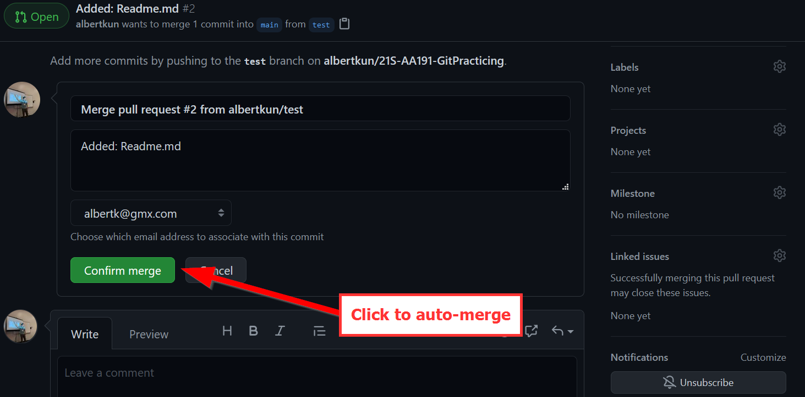
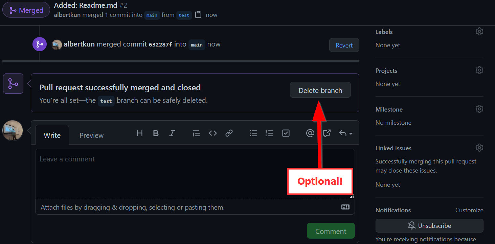
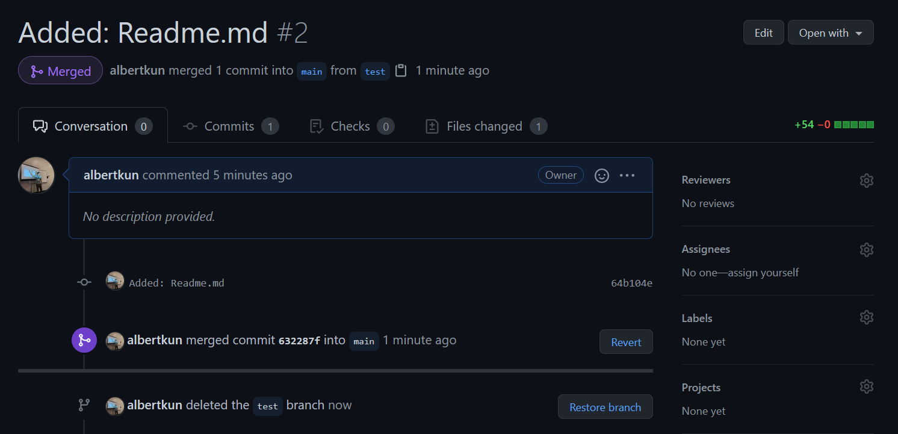

# Collaborating with GitHub and Plugins
### Objectives:
- Clone a new repository
- Create a new branch
- Try adding a JavaScript plugin
- Create a pull request

## Clone or create a new repo:
Start by cloning this repo:
```
git clone https://github.com/albertkun/21S-AA191-GitPracticing.git
```

Remember, here is the basic git commands for adding new changes:

```
git add .
git commit -am "message"
git push
```

[Refer to this medium post for a refresher on git merges](https://medium.com/swlh/git-branching-and-merging-made-easy-f7dacd4aa75e)

## Making a new branch:

```
git checkout -b helloNewBranch
```
This creates a branch called `helloNewBranch` and switches to it!

### `git add .` your changes to the new branch:
Make some changes and add them to the branch:
```
git add .
```

### Add a message to your commit
```
git commit -am "message"
```

### Push your changes to your new branch

This code creates a new branch called `helloNewBranch` on GitHub to push to:
```
git push --set-upstream origin helloNewBranch
```
You only need to run it when the branch DOES NOT exist on GitHub!!! After the branch is on GitHub, use `git push`:
```
git push
```

## Updating your branch
Sometimes you want to make sure your branch is up to date, so you can use the following command:
```
git merge <branch_you_want_to_merge>
```
For example this command will `merge` content from `main` to the branch I am currently on:
```
git merge main
```
However!!!

What happens when a `git push` affects in a file that was changed locally but someone else edited on GitHub?

## Merge Conflicts!!!
A `merge conflict` occurs when one file was changed in two places. For example, Person A edits line 1 of `readme.md` and `Person B` also edits line 1 of `readme.md`. A `git` doesn't know which changes to keep, so a person needs to take a look and manually `merge` them.

First, do a `git pull` which will check if you are behind a commit:

```
git pull
```

When your commit is behind, you may receive this message:
```
error: Your local changes to the following files would be overwritten by merge:
        **SOME FILE(S)**
Please commit your changes or stash them before you merge.
Aborting
Updating 6ac38e2..4dbc13c
```

Do a git commit:

```
git add .
git commit -am "message"
git push
```
After you try to push, this message should pop-up:

```
error: failed to push some refs to 'https://github.com/albertkun/21S-AA191-GitPracticing.git'
hint: Updates were rejected because the tip of your current branch is behind
hint: its remote counterpart. Integrate the remote changes (e.g.
hint: 'git pull ...') before pushing again.
hint: See the 'Note about fast-forwards' in 'git push --help' for details.```
```
Run another `git pull`
```
git pull
```
If files didn't change at the same time, then auto-merging could take place.

Then proceed to push as normal:
```
git push
```
If files did change at the same time, you have to choose which version to keep:


After choosing an option, you can can push as normal:

```
git push
```

With a better understanding of `branches` and `merge conflicts`, now we can go ahead and test some new features without worrying about blowing up our repository!

## Adding a new JavaScript Plugin
Remember last week when we added new basemaps? 

Taking that one step further we can add brand-new functionality to our maps.

While the [Leaflet provider](https://leaflet-extras.github.io/leaflet-providers/preview/) is a plug-in of basemaps for Leaflet, there are many plugins that we can use to add extra functionality to our mapplication in JavaScript as well.
Here are some examples:

#### Visualizations:
- [Turf.js](turfjs.org/)
- [Charts](https://www.chartjs.org/docs/latest/samples/bar/vertical.html)
#### Functions:
- [Scrollama](https://russellgoldenberg.github.io/scrollama/sticky-side/)
#### Leaflet Related:
- [Leaflet Plugins](https://leafletjs.com/plugins.html)
- [Leaflet Cluster Markers](https://github.com/Leaflet/Leaflet.markercluster)

To keep things simple, we will add a cluster marker functionality to our Leaflet map. Clustering makes it easier to see when multiple points are in the same area.

With just a few changes our map will look as follows:


As with when we first used Leaflet we need to include the library, so in our html add the following lines:
>index.html
```html
        <!-- Cluster Marker's CSS -->
        <link rel="stylesheet" href="https://unpkg.com/leaflet.markercluster@1.4.1/dist/MarkerCluster.css" />
        <!-- Cluster Marker's JavaScript -->
        <script src="https://unpkg.com/leaflet.markercluster@1.4.1/dist/leaflet.markercluster.js"></script>
```

Next, let's read the documentation on how to use the `cluster maker`:



Judging from this code, we might be able to simply change our group layers for the markers!

Head over to our `init.js` file and find the following lines for our group layers:
>js/init.js
```js
let speakFluentEnglish = L.featureGroup();
let speakOtherLanguage = L.featureGroup();
```

Change it to:
>js/init.js
```js
let speakFluentEnglish = L.markerClusterGroup();
let speakOtherLanguage = L.markerClusterGroup();
```

And... wow that's it!

This flexibility is what makes opensource tools and plugins so great! However, be warned that not all plugins will be as simple to plug and play.

Congrats!

After you've made this change the time has come to make a pull request!
## Pull Requests
I'm sure you've seen this nagging icon a lot by now:


You will then be greeted by a new page where you can title, assign, comment, etc. about the pull request (or PR):


 and most importantly create a `pull request`:

After clicking the button to `create a new pull request` scroll down to the resulting page:


You should be able to click on `merge` if your `pull request` has no `merge conflicts`:


Click to `confirm` the auto merge:


And now you can delete the branch:


#### Warning: Merge Conflicts do not allow you to auto-merge a Pull Request!
You will be unable to `auto-merge` if there is a merge conflict, so refer to the `merge-conflict` steps in order to finish the `pull request`.

### Completed Pull Request
Your completed pull request should look like the following:


Congrats on finishing the lab! There is no assignment, so you can focus on the Group Assignment #5 due next week.

## Group Assignment #5 - Rough Draft
Create a functional (doesn't have to be pretty or clean) version of your mapplication using the survey from students in class. 

This assignment will be graded on the following:
1. Fulfillment of the user stories set forth in the memo
2. Relevant functionality that is specific to empowering community voices
3. A `readme.md` for the repository that describes the technology used for the project and how others could use it in the future
4. A short 2-minute presentation answering:
   1. Who is the project for and why is it important?
   2. How does the website empower people?
   3. What changes you would like to focus on between now and the final? Why?
   
   Everyone is required to speak.

#### Technical Requirements:
   - A map is required
   - Usage of survey responses is required
   - Please come up with a unique name for your group

### Submission
Post your group's repository in this assignment thread:
https://github.com/albertkun/21S-ASIAAM-191A/discussions/150